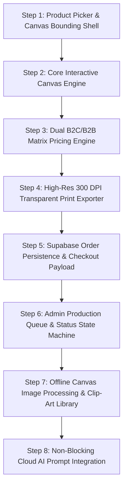

# Implementation Plan: Sweet Ginger Custom T-Shirt Design Studio

## Technical Lead's Sequencing Advisory

> [!CAUTION]
> **Build Sequence Warning**: Building flashy AI image generation or background removal first is a fatal sequencing error. If an agent starts with AI features, it builds on top of an unstable canvas coordinate format and nonexistent order payload schemas. If the design schema changes later, all downstream preview rendering, B2B pricing calculations, and high-res print exports break. **Every deterministic feature must be built, proven, and verified first.** AI integrations come LAST as non-blocking enhancements with local fallbacks.

---

## The One Decision Most Expensive to Reverse Later

### **Normalized Canvas Coordinate Schema (`0.0 - 1.0` Relative Bounding Box Unit Space)**
Storing canvas element positions, dimensions, font sizes, and layer bounds as absolute display pixels (e.g., $x=240\text{ px}, y=180\text{ px}$) relative to a specific browser viewport size is the single most expensive decision to fix later. If display pixels are stored, designs will distort whenever viewed on different screens ($1440\text{ px}$ vs $375\text{ px}$) or when exported to $300\text{ DPI}$ print canvases ($3600 \times 4800\text{ px}$).

* **Rule**: All canvas element positions $(X, Y)$, widths/heights $(W, H)$, and font scale factors **MUST** be stored as normalized relative percentages ($0.0\text{ to }1.0$) relative to the garment's printable bounding box. Reversing an absolute pixel schema later requires rewriting every historical database record and re-architecting the print export pipeline.

---

## The Silent Half-Work Failure Point

### **Export Canvas DPI Downsampling & Device Pixel Ratio ($dpr$) Scaling**
In Step 4 (High-Res Export), canvas rasterization can easily "appear to succeed" in development by outputting a valid PNG file. However, if the export script reads standard browser viewport canvas pixels without multiplying by the $4\times$ print scale factor ($300\text{ DPI}$ target) or fails to normalize for high-density mobile screens (`window.devicePixelRatio`), the exported artwork will silently output at low resolution ($72\text{ DPI}$). 

* **The Danger**: The build passes tests cleanly, but the fault is only discovered in production when Ginger Prints prints a 500-piece corporate B2B order and receives blurry, pixelated graphics.
* **Verification Rule**: Step 4 tests must explicitly assert that exported PNG file dimensions match $3600 \times 4800\text{ px}$ ($300\text{ DPI}$ printable standard) before proceeding to database integration.

---

## Step-by-Step Implementation Order

---

### Step 1: Product Picker & Garment Bounding Shell
* **What Gets Built**: Next.js layout shell, garment product picker data model (Crew Neck, Oversized Tee, Polo, Hoodie, Cap), color swatch picker, Front/Back view toggle, and physical print area bounding box rendering.
* **Why Here**: The entire studio depends on rendering artwork relative to garment coordinates. Establishing garment bounds and aspect ratios first ensures no design coordinates are corrupted downstream.
* **Demonstrable Proof**: Select a product (T-shirt/Hoodie/Cap), click color swatches to change garment shirt color, toggle between Front and Back views, and observe the dashed printable boundary box updating dynamically.
* **What Breaks Downstream**: If garment bounds or aspect ratios are wrong, all text placement, artwork scaling, and print file exports will be misaligned or cut off.

---

### Step 2: Core Interactive Canvas Engine (Text & Artwork Layers)
* **What Gets Built**: Declarative `react-konva` canvas stage with Zustand state controller. Supports custom text (font selector, size slider, color picker, arc/rotation), local artwork image upload (PNG/JPG), multi-layer depth ordering, drag/scale/rotate transforms, and printable boundary enforcement.
* **Why Here**: Core user interaction of the design lab. Must be proven deterministically in-browser without any backend or external API dependencies.
* **Demonstrable Proof**: Type custom text, change fonts and colors, upload a local logo PNG, drag/scale/rotate elements on the shirt canvas, and observe elements being constrained strictly within the dashed print boundary.
* **What Breaks Downstream**: If layer transform coordinates are not normalized properly into relative percentages, switching garment colors, sizes, or exporting print files will warp customer designs.

---

### Step 3: Dual B2C / B2B Matrix Pricing Engine
* **What Gets Built**: Zustand pricing state engine supporting both Single Retail Order quantity input ($1\text{ pc}$) and B2B Wholesale Size Breakdown Matrix (`S, M, L, XL, 2XL, 3XL`). Live volume discount calculator ($1\text{--}5$, $6\text{--}24$, $25\text{--}99$, $100+\text{ pcs}$) and print side surcharge calculator (Front vs Front+Back).
* **Why Here**: Depends on Step 1 (garment base price) and Step 2 (print side detection). Must be verified before building checkout saving.
* **Demonstrable Proof**: Toggle between Single Order (B2C) and Bulk Matrix (B2B). Enter quantities across size input boxes, watch unit prices discount dynamically, and see price adjustments when adding design elements to the Back canvas side.
* **What Breaks Downstream**: Incorrect pricing math causes financial losses on bulk wholesale orders or overcharges retail customers, corrupting cart payloads.

---

### Step 4: High-Res $300\text{ DPI}$ Transparent Print File Exporter
* **What Gets Built**: Deterministic $4\times$ scale canvas rasterizer (`toDataURL` outputting $3600 \times 4800\text{ px}$ transparent PNGs) that hides garment mockups and exports only customer text/artwork assets formatted for DTF/Vinyl printers.
* **Why Here**: Proves that design canvas coordinates are 100% printable before building database storage and backend schemas.
* **Demonstrable Proof**: Click "Download Test Print File" and inspect a crystal-clear $3600 \times 4800\text{ px}$ transparent PNG containing only the customer's text and artwork assets.
* **What Breaks Downstream**: If export scale or background transparency is flawed, Ginger Prints operators receive low-res or dirty background files, producing ruined physical apparel.

---

### Step 5: Supabase Order Persistence & Checkout Payload
* **What Gets Built**: Supabase database tables (`orders`, `order_items`, `designs`), customer checkout form, uploaded artwork storage in Supabase Storage buckets, and complete design JSON state payload saving.
* **Why Here**: Connects the deterministic canvas state (Steps 1–4) to persistent storage and database.
* **Demonstrable Proof**: Complete a checkout flow, inspect the created order in Supabase with attached JSON design coordinates, and verify public image URL links.
* **What Breaks Downstream**: Incomplete JSON state payloads make returning customer designs or admin re-prints impossible.

---

### Step 6: Admin Production Queue & Fulfillment Dashboard
* **What Gets Built**: Protected Admin dashboard (`/admin/orders`) for Ginger Prints operators: order queue list, print technique tags (DTF, Embroidery, Vinyl), operational status updater (`Received` -> `In Production` -> `Printed` -> `Shipped`), and 1-click high-res print file download buttons.
* **Why Here**: Requires persistent database orders from Step 5.
* **Demonstrable Proof**: Log into admin panel, filter orders by status, change an order's status, and download print-ready PNG files directly from the queue interface.
* **What Breaks Downstream**: Staff cannot fulfill orders or track production bottlenecks if state transitions or asset retrieval fail.

---

### Step 7: Offline Canvas Image Processing & Clip-Art Library
* **What Gets Built**: Local HTML5 Canvas `ImageData` chroma key background remover (removes white/solid backgrounds instantly in-browser) + SVG clip-art asset gallery.
* **Why Here**: Non-blocking enhancements; built deterministically before any cloud AI APIs.
* **Demonstrable Proof**: Upload a logo with a white background, click "Remove White Background", observe it turn transparent immediately, and browse local SVG clip-art icons.
* **What Breaks Downstream**: None if isolated properly; enhances artwork upload usability without external failure points.

---

### Step 8: Non-Blocking Cloud AI Prompt Integration (Fallback Enabled)
* **What Gets Built**: HuggingFace / Serverless API route for text-to-image prompt generation with automatic rate-limit detection and fallback to the local clip-art gallery from Step 7.
* **Why Here**: Must come LAST because it is non-deterministic and depends on external API availability (satisfies constraint from `TECH-STACK.md`).
* **Demonstrable Proof**: Type an AI prompt (e.g. "Jaipur royal tiger mascot"), generate a graphic onto the shirt, and verify graceful fallback error messaging when network/API is disconnected.
* **What Breaks Downstream**: If AI API fails, the application falls back gracefully without interrupting core design or order checkout flows.
